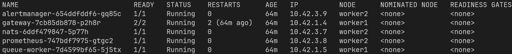
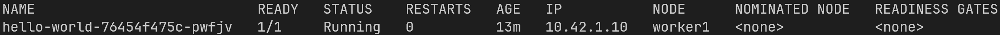
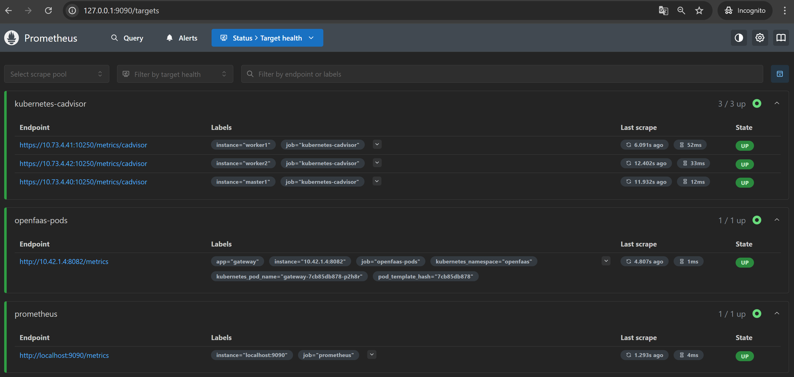
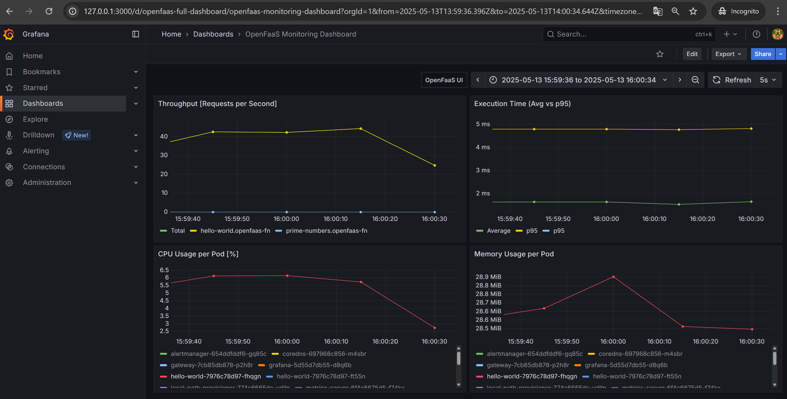

# ⚙️ **K3s-OpenFaaS setup**

This repository contains configuration files, manifests and scripts for deploying [OpenFaaS](https://github.com/openfaas/faas) on a lightweight [K3s](https://github.com/k3s-io/k3s) Kubernetes cluster. Additionally, it includes example Python functions and monitoring setup using [Prometheus](https://github.com/prometheus/prometheus) and [Grafana](https://github.com/grafana/grafana).

## 📑 Table of Contents
1. [Cluster Topology](#-cluster-topology)
2. [Quick Start](#-quick-start)
3. [Running Python functions](#️-running-python-functions)
   - [Creating first function](#simple-hello-world-function)
   - [Calculating prime numbers](#cpu-intensive-function-for-calculating-prime-numbers)
4. [Monitoring](#-monitoring)
   - [Prometheus with cAdvisor](#configuring-prometheus-with-cadvisor)
   - [Prometheus dashboard](#access-prometheus-dashboard)
   - [Grafana](#setting-up-grafana)
   - [Grafana dashboard](#access-grafana-dashboard)

## 🖧 **Cluster Topology**
The K3s cluster in this setup consists of 3 nodes, communicating over a private network (`10.73.4.0/24`):

| Role       | Hostname   | IP Address    |
|------------|------------|---------------|
| Master     | master1    | `10.73.4.40`  |
| Worker 1   | worker1    | `10.73.4.41`  |
| Worker 2   | worker2    | `10.73.4.42`  |

## 🚀 Quick Start
1. Clone this repo on all of your nodes:
   ```bash
   git clone https://github.com/justkow/k3s-openfaas-setup.git
   ```
2. Initialize system settings
   - On `master` node:
      ```bash
      ./initial_setup.sh master1
      ```
   - On each `worker` node:
      ```bash
      ./initial_setup.sh worker1
      ```
      ```bash
      ./initial_setup.sh worker2
      ```
3. Create a `token` file with a K3s token of your choice on all nodes (the token must be the same on both master and worker nodes):
   ```bash
   echo "your_token" > token
   ```
4. Install `k3s` on every node. The argument to the script is master node IP address:
   ```bash
   ./install_k3s.sh 10.73.4.40
   ```
   After installation, run this command to make sure that the process of setting up the cluster was successful:
   ```bash
   sudo kubectl get nodes
   ```
   The output should be similar to this:
   ```bash
   NAME      STATUS   ROLES                  AGE     VERSION
   master1   Ready    control-plane,master   10m     v1.32.4+k3s1
   worker1   Ready    <none>                 2m15s   v1.32.4+k3s1
   worker2   Ready    <none>                 4s      v1.32.4+k3s1
   ```
5. Install `docker` on master node:
   ```bash
   ./install_docker.sh
   ```
6. Install `OpenFaaS` on master node (provide master IP address as the argument for the script)
   > Note: If you run the script multiple times, you have to clean your .bashrc file manually
   ```bash
   sudo ./install_openfaas.sh 10.73.4.40
   ```
   To verify if the installation was successful, run:
   ```bash
   sudo kubectl get pods -n openfaas -o wide
   ```
   The output should look like this:
   
7. Configure Docker registry on all of the nodes:
   ```bash
   sudo ./config_registry.sh 10.73.4.40
   ```

## ▶️ Running Python functions
All operations in this section are performed on the master node. First you have to forward local port to OpenFaaS gateway service:
```bash
faas-port-forward
```
Then login to OpenFaaS:
```bash
faas-login
```
To run your serverless functions, you need to pull the appropriate template from the OpenFaaS repository. For our usecases, the `python-http` template will be used:
```bash
faas-cli template store pull python3-http
```

### Simple "Hello world!" function
Create the function by running the following command:
```bash
faas-cli new hello-world --lang python3-http
```

The function code is in the `hello-world/handler.py` file. You can modify it to return e.g.: "Hello world!"
```python
def handle(event, context):
    return "Hello world!\n"
```

Then you have to modify `stack.yaml` by adding address to your local Docker registry. The final `stack.yaml` should look like this:
```yaml
version: 1.0
provider:
  name: openfaas
  gateway: http://127.0.0.1:8080
functions:
  hello-openfaas:
    lang: python3-http
    handler: ./hello-world
    image: 10.73.4.40:5000/hello-world:latest
    imagePullPolicy: IfNotPresent
```

Finally you have to:
1. Build image with the function
   ```bash
   sudo faas-cli build -f stack.yaml
   ```
2. Push it to the local Docker registry
   ```bash
   sudo faas-cli push -f stack.yaml
   ```
3. Deploy the function
   ```bash
   faas-cli deploy -f stack.yaml
   ```

You can verify if the pod with the function was created correctly by running command:
```bash
sudo kubectl get pods -n openfaas-fn -o wide
```
The output should look similar to this:


Now test you function by running:
```bash
echo "" | faas-cli invoke hello-world
```

### CPU-intensive function for calculating prime numbers
Append `prime-numbers` function to `stack.yaml` file
```bash
faas-cli new --append stack.yaml prime-numbers --lang python3-http
```

Add registry information to the `stack.yaml`, so the functions section for `prime-numbers` looks like this:
```yaml
functions:
  prime-numbers:
    lang: python3-http
    handler: ./prime-numbers
    image: 10.73.4.40:5000/prime-numbers:latest
    imagePullPolicy: IfNotPresent
```

Copy `handler.py` file from this repository to your function directory
```bash
cp k3s-openfaas-setup/functions/prime-numbers/handler.py prime-numbers/handler.py
```

Then build, push, deploy and invoke the function
```bash
sudo faas-cli build -f stack.yaml
sudo faas-cli push -f stack.yaml
faas-cli deploy -f stack.yaml
echo "" | faas-cli invoke prime-numbers
```

## 📊 Monitoring
`Prometheus` is deployed by default as a pod, while installing OpenFaaS.

`cAdvisor` is included in the `kubectl` tool. You can test it by running e.g.:
```bash
sudo kubectl get --raw /api/v1/nodes/worker1/proxy/metrics/cadvisor
```

### Configuring Prometheus with cAdvisor
`cAdvisor` provides valuable performance metrics e.g.: CPU and memory usage per function. For `Prometheus` to be able to read these metrics, proper permissions must be configured.

1. Grant the openfaas-prometheus service account permission to access node metrics, logs, and proxy data for monitoring
   ```bash
   sudo kubectl apply -f k3s-openfaas-setup/manifests/prometheus-clusterrole.yaml
   ```
   ```bash
   sudo kubectl apply -f k3s-openfaas-setup/manifests/prometheus-clusterrolebinding.yaml
   ```
2. Configure cAdvisor targets for Prometheus
   ```bash
   sudo kubectl -n openfaas delete configmap prometheus-config
   ```
   ```bash
   sudo kubectl -n openfaas apply -f k3s-openfaas-setup/manifests/prometheus-config.yaml
   ```
3. Restart Prometheus pod
   ```bash
   sudo kubectl rollout restart deployment prometheus -n openfaas
   ```

### Access Prometheus dashboard
Forward Prometheus port `9090` from pod to the host
```bash
sudo kubectl port-forward -n openfaas deploy/prometheus 9090:9090
```

Additionally, if your Prometheus is on a remote server, you have to create ssh tunel
```bash
ssh -L 9090:localhost:9090 user@10.73.4.40
```

Now access the dashboard in your browser (http://127.0.0.1:9090) and navigate to `Status>Target health`. State of all the targets should be `UP`


### Setting up Grafana
1. Install Helm
   ```bash
   sudo snap install helm --classic
   ```

2. Add the Grafana Helm Repository
   ```bash
   sudo helm repo add grafana https://grafana.github.io/helm-charts
   ```

3. Update Helm Repositories
   ```bash
   sudo helm repo update
   ```

4. Create `monitoring` namespace in your cluster
   ```bash
   sudo kubectl create namespace monitoring
   ```

5. Export the kubeconfig path
   ```bash
   export KUBECONFIG=/etc/rancher/k3s/k3s.yaml
   ```

6. Install Grafana
   ```bash
   sudo helm install grafana grafana/grafana --namespace monitoring --set adminPassword=your_password
   ```

7. Check the status of your Grafana deployment
   ```bash
   sudo kubectl get all -n monitoring
   ```

### Access Grafana dashboard
Forward Grafana port `80` from pod to `3000` on the host
```bash
sudo kubectl port-forward -n monitoring svc/grafana 3000:80
```

Additionally, if your Grafana is on a remote server, you have to create ssh tunel
```bash
ssh -L 3000:localhost:3000 user@10.73.4.40
```

Now access the Grafana web UI in your browser at http://127.0.0.1:3000. When prompted, enter the login `admin` and the password you configured during installation. Then navigate to `Data sources>Add data source`, select Prometheus and provide this address:
```bash
http://prometheus.openfaas.svc.cluster.local:9090
```

Next go to `Dashboards>Create dashboard>Import dashboard` and paste `k3s-openfaas-setup/grafana/dashboard.json` in the textbox. The `OpenFaaS Monitoring Dashboard` will be imported and should look similar to this:

